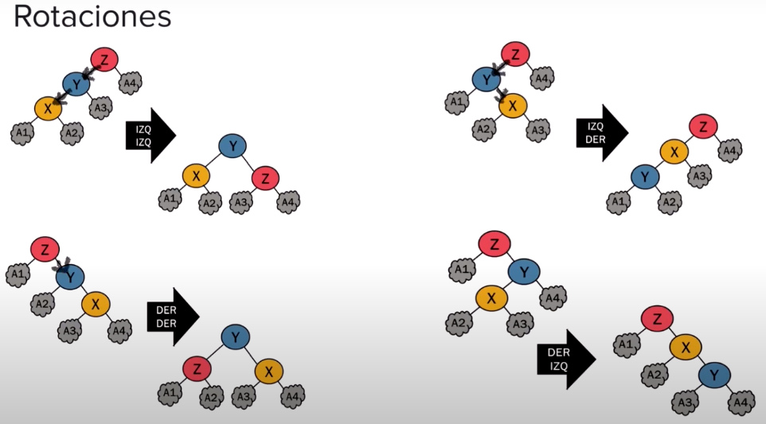

# arbol avl
## inserción
cuando estamos insertando un nuevo nodo dentro de un arbol binario de búsqueda, el nodo padre va a ser a donde su grado del nodo hijo lo lleve:
es decir cuando ingresa un nodo, se revisa la raíz como primer valor, sea numeros enteros, o caracteres, si el valor del nodo hijo es menor al del nodo en donde estamos parados, entonces se nos situarmes en el siguiente nodo consecutivo izquierdo; y se es mayor, se ra a la derecha
#### ahora...
Cada insertamos un nodo, verificamos en que lado va, si izquierda o derecha, y si ya está está lleno los dos caminos, lo insertamos en un nuevo camino...
cada nuevo camino, se podría decir que "es un nuevo nivel en el arbol", un arbol ***AVL*** es un arbol balanceado, ya que la resta de la altura del subarbol derecho menos el subarbol izquierdo, su total tendrá que ser en los rangos de -1, 0 o 1, si no se realiza un balanceo
Las alturas las imprime de la siguiente forma
```java
public void checkBalance(Nodo hijo) {
        Deque <Nodo> unbalance = new LinkedList<>();
        while (true) {
            unbalance.add(hijo);
            LinkedList<Integer> ch;
            if (hijo == null)
                break;
            if (hijo.izq == null)
                ch = chekRight(hijo);
            else
                ch = checkHeight(hijo);
            Integer izq = ch.get(0);
            Integer der = ch.get(1);
            Integer total = izq - der;
            if ((total < -1)||(total > 1)){
                Nodo z = unbalance.pollLast();
                Nodo y = unbalance.pollLast();
                Nodo x = unbalance.pollLast();
                System.out.println("\n");
                System.out.println("Raiz: " + z.valor + " hijo: " + y.valor + " daño: " + x.valor);
                System.out.println("\n");
                balance(x, y, z);
            }
            System.out.println("valor nodo: " + hijo.valor + " Izq: " + izq + " der: " + der);
            hijo = hijo.padre;

        }
    }
```
en la clase anterior, se puede encontrar la clase controladora de las alturas expicada a detalle en el video.

## balanceo
### explicación del funcionamiento de la clase $\downarrow$


[](https://drive.google.com/file/d/1htEN2Bsm8H8mUxb2plqEXOTX84tzNRaI/view?usp=sharing)

seguimos el esquema explicado en el video sobre los cuatro tipos de rotaciones para su balanceo:



## Explicación breve del funcionamiento del programa
