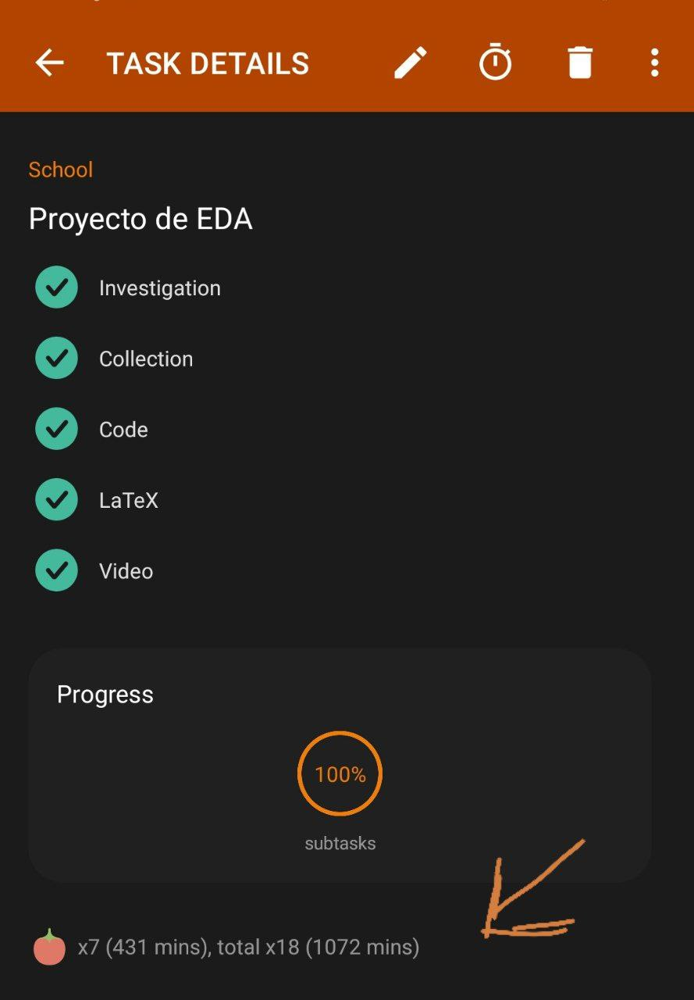

# Día 1 (viernes 22 de abril de 2022)

Minutos dedicados al proyecto: 50 minutos.

Alumno: García Sitio Diego

Investigué un poco RPN (Notación Polaca inversa) y en esencia es lo mismo que un recorrido (se denomina recorrido de un árbol al proceso que permite visitar al menos una vez a todos los nodos del árbol) PostOrden.

> Recordemos que el recorrido PostOrden se realiza de la siguiente manera:  
> 1) Recorrer el subárbol izquierdo en PostOrden.
> 2) Recorrer el subárbol derecho en PostOrden.
> 3) Examinar la raíz.<br>
> Enlace a esta explicación [aquí en el minuto 34:06](https://www.youtube.com/watch?v=KpqAy-uZ-04).

> La notación polaca inversa (en inglés, Reverse Polish Notation, o RPN), es una forma alternativa de escribir expresiones matemáticas. Por ejemplo, la expresión "20 - (4 + 3) * 2" en RPN es "20 4 3 + 2 * -". <br> El enlace a esta información está [aquí](https://www.glc.us.es/~jalonso/exercitium/notacion-polaca-inversa/#:~:text=La%20notaci%C3%B3n%20polaca%20inversa%20(en,3%20+%202%20*%20-%22%20.)).

Después vi que los operadores matemáticos que voy a utilizar para hacer las operaciones son: 

* paréntesis "()" (esto ya no lo agregué en la versión final por mis situaciones personales)
* multiplicación "*"
* división "/"
* suma "+"
* resta "-"
  
Evidentemente respetando su jerarquía de operaciones.

<br>

Además, me di cuenta que los números funcionan más como hojas o hijos, y que los operadores fungen más como nodos padre:

<figure>
    
    <figcaption>Árbol de expresiones aritméticas "1+2*3-4/5"</figcaption>
</figure>

<br> <br>

# Día 2 (martes 3 de mayo de 2022)

Minutos dedicados al proyecto: 150 minutos.

> Hago unas revisiones del primer día (nada fuerte, solo explico la imagen y corrijo algunas faltas de ortografía).

Ahora, en este día me dedico a imaginar cómo voy a construir el programa, así que tomo lápiz y papel y empiezo a dibujar lo siguiente:

<figure>
    
    <figcaption><i>Boceto 1: Asignación de operadores a los nodos</i></figcaption>
</figure>

<br> <br>

<figure>
    
    <figcaption><i>Boceto 2: Una idea de cómo dividir el String</i></figcaption>
</figure>

<br> <br>

En el boceto 1 empiezo a ver cómo colocar los "nodos operadores". Por ejemplo, si la lista de operadores es la siguiente: [*, /, +, +, -, *]; La cantidad de operadores es 6, esto se divide entre 2 y se le suma 1, el resultado es 4. Entonces, se busca el cuarto operador en la lista, y nos daremos cuenta de que es "+". Ese operador se coloca en la raíz, posteriormente se van a gregando los demás operadores como se muestra en el **_Boceto 1_**. 

Después, en el boceto 2, mi idea era pedirle al usuario que separara cada número y cada operador con un espacio, pero entonces investigué más a fondo el método [*split()*](https://es.stackoverflow.com/questions/45846/c%C3%B3mo-separar-un-string-en-java-c%C3%B3mo-utilizar-split). Cuando descubrí que podía agregar más separadores, hice el siguiente código de prueba y su ejecución me dejó satisfecho:

```java
package proyecto2;
import java.util.Arrays;

public class Proyecto2 {

    public static void main(String[] args) {
        String palabras = "1+2*3-4/5";
        String[] textoSeparado = palabras.split("\\+|\\*|\\-|\\/");
        System.out.println("String original: "+palabras);
        System.out.println("String separado: ");
        System.out.println(Arrays.toString(textoSeparado));
    }
}
```

<figure>
    
</figure>

<br> <br>

# Día 3 (Viernes 6 de mayo de 2022)

Minutos dedicados al proyecto: 100 minutos.

> Hice unas revisiones en el código, agregué un segungo *array* de tipo String para guardar los operadores.

Cuando decidí agregar los operadores en un array, me di cuenta de que me agregaba un dato, por decirlo de alguna forma, nulo, ya que no me arroja ningun dato en sí (además, al no agregar ciertas especificaciones, los separadores se vuelven inservibles o en mi contra):

<figure>
    
</figure>

En esta ejecución decidí agregar un "11" en lugar del "1" para ver cómo funcionaban mis operadores, pero resulta que dejar como separador a "1" no funciona, porque me deja más espacios de lo querido. Así que pensé en otras soluciones.

El primer paso fue crear dos métodos: *separadorDeOperadores* ( método de tipo *String* que crea un *separador* personalizado para ayudar a identificar los operadores y guardarlos en el array) y *eliminandoEspacios* (método de tipo *String[]* que quita los valores basura del array original para guardar los operadores en un nuevo array).

Con lo anteriormente dicho, logro conseguir la siguiente  ejecución satisfactoria:

<figure>
       
</figure>

Después, reutilicé las clases que nos brindó el profesor de árboles binarios, solo que cambiando el tipo de variable (en vez de mandar números enteros, voy a enviar los valores como *Strings* para crear los nodos). Las clases reutilizadas son: "ArbolBin.java" y "Nodo.java".

Hice bastante pseudo-código en una hoja para idear cómo guardar los nodos, me llevó hasta la madrugada, así que solo anotaré los minutos que le dediqué al proyecto "el día de hoy" . Más al rato explico lo que hice en el día 4.

# Día 4 (Viernes 6 de mayo de 2022)

Minutos dedicados al proyecto: 100 minutos.

> Revisé lo que hice en días anteriores para entrar en flujo

El "pseudo-código" que hice estaba bastante desordenado y mal hecho, así que decidí acomodarlo un poco, además de enumerar los pasos de mis pensamientos para un mayor orden. Así luce mi bosquejo para almacenar los nodos de los operadores:

<figure>
    
    <figcaption><i>Boceto 3: Una idea de cómo guardar los nodos "padres" en la lista de nodos.</i></figcaption>
</figure>

<br> <br>

En esta ocasión hago uso de la recursividad y de varias instrucciones if. Como suele pasar, mi pseudo-código está un poco mal escrito, pues la recursividad se repite de manera infinita arrojando errores, por lo que hice modificaciones, quedando el siguiente código que funciona perfectamente (también agrego su ejecución):

```java
public void NodosDeOperadores(int index, int resta, String[] limite, int contador){
        Nodo nodoOperador;
        //Este if sirve para romper la recursividad
        if(limite.length != contador){
            if((index-resta)%2 == 0 | index == 1){
                nodoOperador = new Nodo(limite[index]);
                listaDeTodosLosNodos.add(nodoOperador);
                if(index == 1)
                    index+=1;
                index+=1;
                contador+=1;
                NodosDeOperadores(index, resta, limite, contador);
            }else{
                nodoOperador = new Nodo(limite[resta]);
                listaDeTodosLosNodos.add(nodoOperador);
                resta+=1;
                contador+=1;
                NodosDeOperadores(index, resta, limite, contador);
            }   
        }
    }
```

<figure>
       
</figure>

Como se muestra en la ejecución, se imprimen los nodos en el orden que deseaba, cumpliendo mi objetivo. Ahora siguen los números para después construir el árbol.

> Al final logré guardar los números como nodos en la lista, intenté construir el árbol, pero fue más complejo de lo que esperaba.


# Día 5 (Domingo 8 de mayo de 2022)

Minutos dedicados al proyecto: 300 minutos.

Al inicio del día comencé a pensar cómo crear los métodos para construir el árbol, ya que en la noche del viernes recordaba que era más complejo de lo que creía. 

Tome hoja y lápiz para hacer la lógica que debería seguir.

Una fotografía de todo lo que hice (también en la parte de atrás de cada hoja hice más bocetos lógicos):

<figure>
       
</figure>

Al final, tomé como referencia estos árboles para hacer mis pruebas:

<figure>
       
</figure>

Teniendo este material, me dispuse a hacer los métodos que tenía pensados:

```java
//public void contruyendoArbol()
//public void contruyendoNodosHoja(int numeroDeNodos)
```
En el primer método voy a construir la raíz y las ramas de los árboles, pues me di cuenta que ningun operador es nodo hoja, solo los números, así que decidí crear un for en donde se agregan los operadores derechos (ya que en cualquier caso siempre habrán mínimo tres nodos [1+1], sin importar que solo sea un operador). 

Una vez se crea la raíz con sus ramas, este método llamará al segundo: *contruyendoNodosHoja*.

Como su nombre lo indica, *contruyendoNodosHoja* se va a encargar de agregar los nodos hoja al árbol. A decir verdad, este método me tomó demasiado tiempo, de ahí las numerosas hojas para desarrollar una lógica. Al final decidí dividir el árbol en dos, dicho de otra forma, primero voy agregar los nodos hoja de la parte izquierda del árbol, después sus nodos hoja de la parte derecha.
Antes de esto defino dos variables muy importantes: una que almacena cuántos números tiene el árbol y la otra cuántos operadores tiene. Esto será muy importante para localizar los nodos en la lista, pues necesitamos ser exactos a la hora de construir el árbol.

Ya cuando se termine de construir el árbol, el programa va arrojar el mensaje de **"Se ha construido satisfactoriamente el árbol"**.

Para corroborar que se hizo correctamente el árbol, llamamos al método BFS que brindó el profesor en la práctica de árboles.

La ejecución de todo esto queda de la siguiente manera:

<figure>
       
</figure>

Después hice BFS manualmente y queda de la siguiente forma:

<figure>
       
</figure>

Después de analizar el avance que tuve y mi éxito, decidí cambiar el nombre de mi clase "main" a "PruebasDelArbol", para dejar esa clase como una forma documentar lo que fui probando antes de agregarlo al proyecto final. Una vez esto, decidí agregar los métodos que hice en otras clases llamadas: "Menu" e "IngresarDatos".

En esas clases solo traslado lo que hice en "PruebasDelArbol", solo que ya con mi menú. La ejecución queda de la siguiente manera:

<figure>
       
</figure>

Cuando terminé esto, decidí hablarle a mi compañero Rosillo sobre cómo juntar todo, por lo que vimos la opción de usar GitHub. Nos tardamos en acomodar todo aprox. una hora, pero al final logramos conectar todo en el repositario de GitHub. Adjunto pruebas:

<figure>
       
</figure>

# Día 6 (Martes 10 de mayo de 2022)

Minutos dedicados al proyecto: 300 minutos.

> En este día decidí terminar solo lo de la notación polaca inversa, ya que, por situaciones muy fuertes a nivel personal, no dispongo de mucho tiempo ahora.

Mientras ayer (Lunes 9 de mayo de 2022) arreglaba papeles y asuntos, en la hora de la cena pensé un poco en cómo hacer el recorrido PostOrden (ya que no pude completar la práctica de árboles al 100%). Tuve una vaga idea y solo escribí lo que creía. Ahora que ya es martes y dispongo de mejor ánimo, tomé los garabatos que hice el día de ayer y empecé a elaborar un pseudo-código. Aquí una captura de todo el proceso:

<figure>
       
</figure>

Una vez que no encontraba fallas en mi lógica, lo pasé a código. Vi que tuve una ejecución satisfactoria, así que solo modifique algunos *println* para limpiar mejor lo que arrojaba el programa. Como dije al inicio de este día, ya no dispongo del tiempo que creía tener, así que hasta acá finalizo con el código, cumplí con la mayoría de puntos. Me hubiera gustado resolver la operación aritmética, pero eso tendrá que quedarse para el futuro.

La ejecución final queda así:

<figure>
       
</figure>

Un detalle que cambié fue el de renombrar a la clase "PruebasDelArbol" como "PruebasDelArbolAritmetico". También a la clase "Menu" la renombré como "MainAR".

Para finalizar, hice mi parte del LaTeX para después guiarme con esta bitácora y hacer mi video. De igual forma, le pedí a mi equipo que grabara cada quien su video explicando su código para unir cada vídeo en uno solo, esto con la ayuda de un programa de edición de vídeo. También escribo mi conclusión.

Aquí adjunto la cantidad de tiempo total aproximado que invertí en el proyecto:

<figure>
       
</figure>

